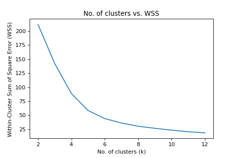
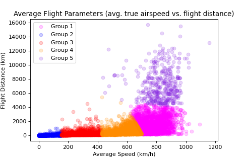

# Overview

This is an app that displays partial global air traffic activity (currently between January 2020 and April 2020) from the OpenSky dataset in an interactive map. In addition, the recorded air traffic is defined into 5 clusters/groups depending on the flight average speed and flight distance. The dataset utilized in this app is 1.25% of the full original dataset. The full dataset is over 160 MB for the time period stated previously and is too computationally demanding time-wise as well as space-wise for the preliminary conceptual phase that the app is currently in.

The app (interactive map) is deployed here: https://rbakshi94.github.io/OpenSky-network-2020-flight-data-analysis/

## Data Source

https://zenodo.org/record/3928550
Matthias Schäfer, Martin Strohmeier, Vincent Lenders, Ivan Martinovic and Matthias Wilhelm.
"Bringing Up OpenSky: A Large-scale ADS-B Sensor Network for Research".
In Proceedings of the 13th IEEE/ACM International Symposium on Information Processing in Sensor Networks (IPSN), pages 83-94, April 2014.

## Air Traffic Grouping/Clustering

The clusters were arrived upon by performing a K-Means clustering analysis on the data. The optimal number of clusters were chosen by computing an "elbow method" plot and upon examination, deciding on k=5 clusters. The "elbow method" plot, which shows the WSS (within-cluster sum of square error) with respect to k (no. of clusters) is shown below:

The five most common aircraft models are also presented in a table for each group on the interactive map.

Below is a plot that shows the five clusters arrived upon via KMeans Clustering on the Flight Average Speed and Flight Distance variables.

## Findings

Per the table presenting common aircraft in each group, it was determined that Group 2 cluster (slowest speeds and smallest flight distances) is mainly common to inter-city helicopter flights. Group 3 (Second-most slowest speeds and second-smallest flight distances) is comprised of larger General Aviation aircraft as well as small utility-class turbo-prop aircraft. Group 4 (the mid-parameter group) consists of smaller narrow-body jet airliners with shorter flight ranges. Group 1 (second-highest velocities and second-highest flight distances) is common to larger narrow-body jet airliners. Group 5 is comprised of wide-body, long-range jet airliners with high payload capacities.

Variants of Airbus A320 were found to be prevalent among all three intermediary groups.

## Next Steps

I am aiming to integrate data for all of 2019 and 2020 available via OpenSky into this app and create time-dependent filters in the interactive map. From this, a user can analyze air traffic patterns/activity pre-covid as well as throughout the course of the pandemic. In addition, I hope to perform additional analyses and dataset integrations from other sources that yield additional information into this app as well as for the app to be an outlet for users to interpret such data and discover findings of their own.
